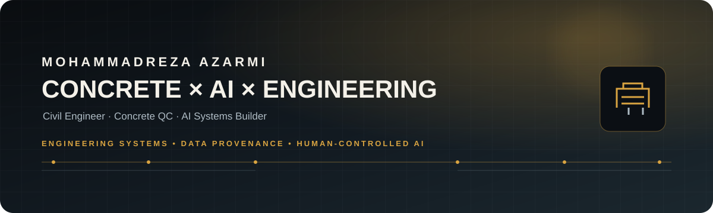
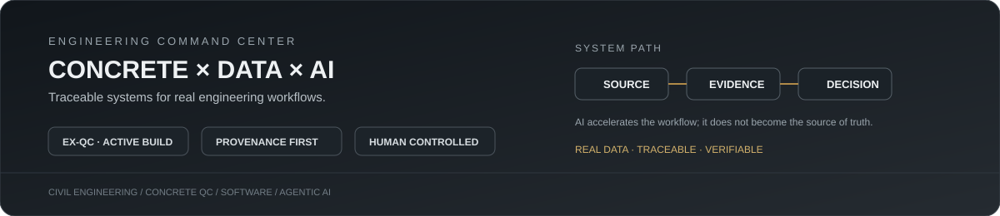
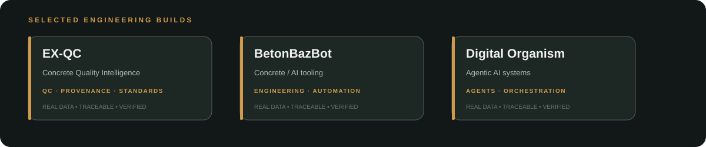

<!-- PROFILE SKIN: Industrial Intelligence / Concrete × AI / v2 -->
<div align="center">
  <picture>
    <source media="(prefers-color-scheme: dark)" srcset="./assets/profile-hero.svg">
    <source media="(prefers-color-scheme: light)" srcset="./assets/profile-hero.svg">
    
  </picture>
</div>

<div align="center">
  
</div>

<br>

<div align="center">

[EX-QC](https://github.com/azarmi8/concrete-qc-cloud) · [BetonBazBot](https://github.com/azarmi8/BetonBazBot) · [betonbaz-api](https://github.com/azarmi8/betonbaz-api)

</div>

---

<div align="center">

**CIVIL ENGINEER · CONCRETE QC · AI SYSTEMS BUILDER**

*Engineering reality → structured data → traceable decisions.*

</div>

<br>

<div align="center">
  
</div>

---

## ⚙️ EX-QC  ·  CONCRETE INTELLIGENCE

### Concrete Quality Intelligence

> A professional concrete QC platform built around **real data, evidence, provenance, human review and standards-aware rules**.

<table>
<tr>
<td width="50%" valign="top">

**CORE**

- Multi-tenant QC workflows
- Source-to-result provenance
- Variable specimen structures
- Human-controlled approval
- Auditability & tenant isolation

</td>
<td width="50%" valign="top">

**INTELLIGENCE**

- Document extraction
- Mapping proposals
- Evidence-aware rules
- Standards integration
- AI as an accelerator — not a source of truth

</td>
</tr>
</table>

<div align="center">

**SOURCE**  →  **DATA**  →  **EVIDENCE**  →  **RULES**  →  **INTELLIGENCE**  →  **DECISION**

</div>

---

## 🧱 WHAT I BUILD

<table>
<tr>
<td align="center" width="25%"><b>ENGINEERING</b><br><sub>Concrete QC<br>Laboratory workflows<br>Standards evidence</sub></td>
<td align="center" width="25%"><b>DATA</b><br><sub>Extraction<br>Validation<br>Provenance</sub></td>
<td align="center" width="25%"><b>AI</b><br><sub>Agents<br>LLM workflows<br>Automation</sub></td>
<td align="center" width="25%"><b>SYSTEMS</b><br><sub>Next.js<br>Supabase<br>CI/CD</sub></td>
</tr>
</table>

---

## 🚀 SELECTED BUILDS

<div align="center">
  
</div>


| Project | What it is |
|---|---|
| **EX-QC** | Concrete quality intelligence platform — active |
| **BetonBazBot** | Concrete / engineering AI tooling |
| **betonbaz-api** | Engineering API / backend tooling |
| **Digital Organism** | Agentic AI systems & orchestration |

---

## 🧠 ENGINEERING PRINCIPLES

<div align="center">

**REAL DATA**  
Evidence over guesses.

**TRACEABLE**  
Every important value should have a source.

**SAFE**  
Missing or ambiguous data stays missing or goes to review.

**HUMAN-CONTROLLED**  
Automation proposes. People decide.

**MODULAR**  
Reuse mature components instead of reinventing everything.

</div>

---

## 🛠️ SYSTEM STACK

<div align="center">

**Frontend**  
Next.js · React · TypeScript · Tailwind CSS

**Data & Backend**  
Supabase · PostgreSQL · RLS · REST APIs

**Engineering**  
Concrete QC · Laboratory workflows · Data validation · Standards evidence

**AI & Automation**  
LLM extraction · Agent systems · Model routing · Workflow automation

**DevOps**  
GitHub · GitHub Actions · CI · Automated verification

</div>

---

## 🔬 SYSTEM FLOW

```text
SOURCE FILES
     │
     ▼
EXTRACTION
     │
     ▼
MAPPING PROPOSALS
     │
     ▼
HUMAN REVIEW
     │
     ▼
QC REGISTRY
     │
     ▼
SAMPLE
     │
     ▼
TEST SERIES
     │
     ▼
SPECIMENS
     │
     ▼
RESULTS
     │
     ▼
PROVENANCE + STANDARDS + DECISION
```

---


## 📊 BUILD SIGNAL

<div align="center">


<sub>CONSISTENCY · SYSTEM DESIGN · SHIPPING · VERIFICATION</sub>

</div>

## 📌 NOW BUILDING

**EX-QC** is the main build.

The direction is deliberately different from a typical AI dashboard:

> **AI should make engineering software smarter — never make engineering data less trustworthy.**

---

## 🌐 CONNECT

<div align="center">

[GitHub](https://github.com/azarmi8) · [EX-QC Repository](https://github.com/azarmi8/concrete-qc-cloud) · [BetonBazBot](https://github.com/azarmi8/BetonBazBot)

</div>

<br>

<div align="center">
<sub>CONCRETE × DATA × AI × ENGINEERING</sub>
</div>
