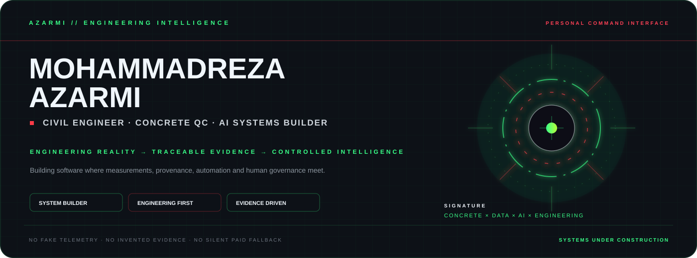

 

<strong>ENGINEERING INTELLIGENCE · REAL SYSTEMS · CONTROLLED AI</strong>

---

## 01 / WHO I AM

### Mohammadreza Azarmi

**Civil Engineer · Concrete QC · Engineering Intelligence · AI Systems Builder**

I build software around **real engineering work** — where measurements matter, evidence matters, and automation must remain observable and governed.

> **AI accelerates execution. It does not rewrite reality.**

| EVIDENCE | REAL STATE | CONTROL |
|---|---|---|
| Traceable inputs, decisions and outcomes. | No invented telemetry or progress. | Automation operates inside explicit boundaries. |

---

## 02 / THE SYSTEMS

<table>
<tr>
<td width="33%" valign="top">

### 🛰️ AGENT HQ

**Autonomous AI Company Control Plane**

Agents, missions, execution, society, training, career, R&D and governed self-improvement.

**MISSION → EXECUTION → EVIDENCE → DELIVERY**

<a href="https://github.com/azarmi8/agent-hq">OPEN SYSTEM ↗</a>

</td>

<td width="33%" valign="top">

### 🧠 CRETIQ

**Concrete Engineering Intelligence**

Concrete QC, laboratory workflows, standards, evidence, analytics, environment and governed AI.

**ENGINEERING → DATA → INTELLIGENCE**

<a href="https://github.com/azarmi8/cretiq">OPEN SYSTEM ↗</a>

</td>

<td width="33%" valign="top">

### 🧪 VIRTUAL CONCRETE LAB

**Interactive Materials Simulation**

Perform procedures, read instruments, analyse results, make decisions and learn from measured outcomes.

**MEASURE → DECIDE → ANALYSE → LEARN**

<a href="https://github.com/azarmi8/virtual-concrete-lab">OPEN SYSTEM ↗</a>

</td>
</tr>
</table>

---

## 03 / SYSTEM ARCHITECTURE

**AGENT HQ**  
Control Plane · Mission Control · Agent Society · R&D

↓

**GOVERNED INTELLIGENCE**

↙　　　　　　　　　　　　　　　　　↘

**CRETIQ**　　　　　　　　　　 **VIRTUAL CONCRETE LAB**  
Engineering Platform　　　　　 Simulation / Training

↘　　　　　　　　　　　　　　　　　↙

**CONCRETE ENGINEERING REALITY**

---

## 04 / ENGINEERING STACK

<table>
<tr>
<td><strong>Engineering</strong> Concrete QC · Laboratory workflows · Standards · Validation · Simulation</td>
<td><strong>AI Systems</strong> Agent runtimes · LLM workflows · Provider routing · R&amp;D · HITL</td>
</tr>
<tr>
<td><strong>Product</strong> Engineering UX · Data products · Interactive systems · Automation</td>
<td><strong>Delivery</strong> GitHub-first · CI · Cloud execution · Evidence-driven verification</td>
</tr>
</table>

---

## 05 / SELECTED BUILDS

<table>
<tr>
<td><strong>AGENT HQ</strong> AI company control plane <a href="https://github.com/azarmi8/agent-hq">→ Repository</a></td>
<td><strong>CRETIQ</strong> Concrete engineering intelligence <a href="https://github.com/azarmi8/cretiq">→ Repository</a></td>
<td><strong>VIRTUAL LAB</strong> Interactive concrete simulation <a href="https://github.com/azarmi8/virtual-concrete-lab">→ Repository</a></td>
<td><strong>CRETIQ 6044</strong> Interactive engineering education <a href="https://github.com/azarmi8/standard-6044-interactive">→ Repository</a></td>
</tr>
</table>

---

## 06 / BUILD PROTOCOL

`REAL WORK`  
↓  
`OBSERVE`  
↓  
`RESEARCH`  
↓  
`BUILD`  
↓  
`VERIFY`  
↓  
`SHIP`  
↓  
`LEARN`  
↓  
`IMPROVE`

**The target is not a flashy demo. The target is a system that survives real work.**

---

## 07 / ENGINEERING CONSTITUTION

**EVIDENCE OVER GUESSING**  
When evidence is missing, the system says it is missing.

**REAL STATE ONLY**  
No synthetic agents, fake progress, fabricated telemetry or invented success.

**AUTOMATION ≠ AUTHORITY**  
Agents can execute inside defined boundaries; governance remains explicit.

**FREE-FIRST**  
No silent paid fallback. Resource constraints are system state.

**CONTINUOUS IMPROVEMENT**  
Validated outcomes become inputs for the next iteration.

---

## 08 / ECOSYSTEM

| SYSTEM | ROLE |
|---|---|
| **Agent HQ** | AI company control plane |
| **Cretiq** | Concrete engineering intelligence |
| **Virtual Concrete Lab** | Simulation, research and training |
| **CRETIQ 6044** | Interactive engineering education |
| **BetonBazBot** | Applied concrete / engineering AI tooling |
| **betonbaz-api** | Supporting engineering API |

---

## 09 / CURRENT FOCUS

### ENGINEERING INTELLIGENCE STACK

**Concrete × Data × AI × Automation × Simulation × Autonomous Systems**

 

ENGINEERING REALITY  
↓  
STRUCTURED EVIDENCE  
↓  
INTELLIGENCE  
↓  
EXECUTION  
↓  
MEASURED OUTCOMES  
↓  
CONTINUOUS IMPROVEMENT

 

 

<strong>NEVER INVENT THE DATA.</strong>

 

SYSTEMS UNDER CONSTRUCTION · ALWAYS VERIFYING · ALWAYS LEARNING

