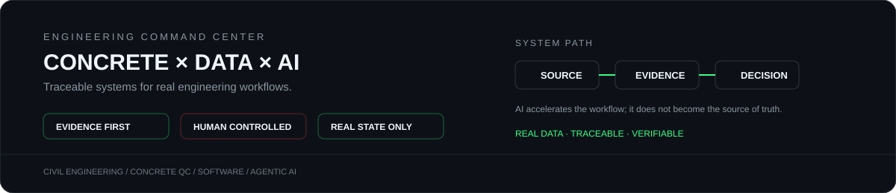

 

  
  
  

<strong>REAL ENGINEERING · TRACEABLE DATA · CONTROLLED INTELLIGENCE</strong>

---

## 01 / COMMAND PROFILE

### Mohammadreza Azarmi

Civil Engineer · Concrete QC · Engineering Intelligence · AI Systems Builder

I build systems where **real engineering operations**, **traceable evidence**, and **AI-assisted execution** meet.

> **AI accelerates the work. It does not get to rewrite reality.**

### Core operating doctrine

| SIGNAL | RULE |
|---|---|
| **EVIDENCE** | Decisions should be traceable to real evidence. |
| **REAL STATE** | No fake telemetry, fake progress, or invented success. |
| **CONTROL** | Engineering and governance boundaries stay explicit. |
| **DELIVERY** | Build → Verify → Ship → Learn → Improve. |
| **COST** | Free-first architecture; never silently fall back to paid usage. |

---

## 02 / PRIMARY SYSTEMS

<table>
<tr>
<td width="33%" valign="top">

### 🛰️ Agent HQ

**Autonomous AI Company Control Plane**

Agents, missions, execution, society, training, career, R&D, observability and governed self-improvement.

**Flow**

Mission → Agent → Execution → Evidence → PR / CI → Review → Progress

<a href="https://github.com/azarmi8/agent-hq">ENTER AGENT HQ →</a>

</td>
<td width="33%" valign="top">

### 🧠 Cretiq

**Concrete Engineering Intelligence**

Engineering workflows connecting concrete QC, laboratory data, standards, evidence, analytics, environment and governed AI.

**Product**

Engineering + Data + AI + Experience

<a href="https://github.com/azarmi8/cretiq">ENTER CRETIQ →</a>

</td>
<td width="33%" valign="top">

### 🧪 Virtual Concrete Lab

**Interactive Materials Simulation**

A virtual laboratory focused on performing procedures, reading instruments, analysing results, making decisions and learning from mistakes.

**Experience**

Measure → Decide → Analyse → Learn

<a href="https://github.com/azarmi8/virtual-concrete-lab">ENTER VIRTUAL LAB →</a>

</td>
</tr>
</table>

---

## 03 / SYSTEM MAP

**AGENT HQ**  
Control Plane / Mission Control / Agent Society

↓  

**R&D + EVOLUTION + GOVERNANCE**

↓

**GOVERNED INTELLIGENCE**

↙　　　　　　　　　　　↘

**CRETIQ**　　　　　　　**VIRTUAL CONCRETE LAB**  
Engineering Product　　　 Simulation / Training

↘　　　　　　　　　　　↙

**CONCRETE ENGINEERING**

---

## 04 / ENGINEERING STACK

<table>
<tr>
<td><strong>Engineering</strong> Concrete QC · Laboratory workflows · Standards · Validation · Simulation</td>
<td><strong>AI Systems</strong> Agent runtimes · LLM workflows · Provider routing · HITL · R&D</td>
</tr>
<tr>
<td><strong>Software</strong> TypeScript · React · Next.js · Python · PostgreSQL</td>
<td><strong>Delivery</strong> GitHub-first · CI · Cloud execution · Evidence-driven verification</td>
</tr>
</table>

---

## 05 / FEATURED WORK

---

## 06 / CRETIQ ECOSYSTEM

| SYSTEM | MISSION | ROLE |
|---|---|---|
| **Agent HQ** | AI company control plane | Flagship AI infrastructure |
| **Cretiq** | Concrete engineering intelligence | Flagship engineering product |
| **Virtual Concrete Lab** | Simulation & training | Research / education |
| **CRETIQ 6044** | Interactive engineering standard | Education runtime |
| **BetonBazBot** | Concrete & engineering AI tooling | Applied assistant |
| **betonbaz-api** | Engineering API | Supporting service |

---

## 07 / BUILD LOOP

**REAL WORK**  
↓  
**OBSERVE**  
↓  
**RESEARCH**  
↓  
**BUILD**  
↓  
**VERIFY**  
↓  
**SHIP**  
↓  
**LEARN**  
↓  
**IMPROVE**

**The goal is not a flashy demo. The goal is a system that survives real engineering work.**

---

## 08 / NON-NEGOTIABLES

- **No guessing where evidence is required.**
- **No fake telemetry or synthetic progress presented as reality.**
- **No silent paid fallback.**
- **No uncontrolled production mutation.**
- **No confusing automation with authority.**
- **No stopping at a prototype when the architecture needs a real product.**

---

## 09 / CURRENT DIRECTION

### ENGINEERING INTELLIGENCE

**Concrete × Data × AI × Automation × Simulation × Autonomous Systems**

Engineering Reality  
→ Structured Evidence  
→ Intelligence  
→ Autonomous Execution  
→ Measured Outcomes  
→ Continuous Improvement

### SYSTEMS UNDER CONSTRUCTION

Building serious engineering software for the next generation of industrial intelligence.

  

  

<strong>CONCRETE × DATA × AI × ENGINEERING</strong>

