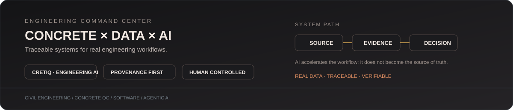

 

<strong>ENGINEERING INTELLIGENCE · REAL SYSTEMS · CONTROLLED AI</strong>

---

## 01 / IDENTITY

### Mohammadreza Azarmi

**Civil Engineer · Concrete QC · Engineering Intelligence · AI Systems Builder**

I build software around real engineering work — where measurements, evidence and governance matter.

> **AI accelerates execution. It does not rewrite reality.**

| EVIDENCE | REAL STATE | CONTROL |
|---|---|---|
| Traceable inputs and outcomes. | No invented telemetry or progress. | Automation stays inside explicit boundaries. |

---

## 02 / FLAGSHIP SYSTEMS

<table>
<tr>
<td width="33%" valign="top">

### 🛰️ AGENT HQ

**Autonomous AI Company Control Plane**

Agents · Missions · Execution · Society · Training · Career · R&amp;D

**MISSION → EXECUTION → EVIDENCE → DELIVERY**

<a href="https://github.com/azarmi8/agent-hq">Repository ↗</a>

</td>

<td width="33%" valign="top">

### 🧠 CRETIQ

**Concrete Engineering Intelligence**

QC · Laboratory · Standards · Analytics · Environment · Governed AI

**ENGINEERING → DATA → INTELLIGENCE**

<a href="https://github.com/azarmi8/cretiq">Repository ↗</a>

</td>

<td width="33%" valign="top">

### 🧪 VIRTUAL CONCRETE LAB

**Interactive Materials Simulation**

Procedure · Measurement · Analysis · Decision · Learning

**MEASURE → DECIDE → ANALYSE → LEARN**

<a href="https://github.com/azarmi8/virtual-concrete-lab">Repository ↗</a>

</td>
</tr>
</table>

---

## 03 / SYSTEM MAP

**AGENT HQ** — Control Plane · Mission Control · Agent Society · R&amp;D

↓

**GOVERNED INTELLIGENCE**

↙　　　　　　　　　　　　　　　　　↘

**CRETIQ**　　　　　　　　　　 **VIRTUAL CONCRETE LAB**  
Engineering Platform　　　　　 Simulation / Training

↘　　　　　　　　　　　　　　　　　↙

**CONCRETE ENGINEERING REALITY**

---

## 04 / ENGINEERING SURFACE

| DOMAIN | FOCUS |
|---|---|
| **Engineering** | Concrete QC · Laboratory workflows · Standards · Validation · Simulation |
| **AI Systems** | Agent runtimes · LLM workflows · Provider routing · R&amp;D · HITL |
| **Software** | TypeScript · React/Next.js · Node.js · Python · APIs · PostgreSQL |
| **Delivery** | Git · GitHub · Actions · Cloud execution · Evidence-driven verification |

---

## 05 / SELECTED BUILDS

| SYSTEM | ROLE |
|---|---|
| **Agent HQ** | AI company control plane |
| **Cretiq** | Concrete engineering intelligence |
| **Virtual Concrete Lab** | Simulation, research and training |
| **CRETIQ 6044** | Interactive engineering education |
| **BetonBazBot** | Applied concrete / engineering AI tooling |
| **betonbaz-api** | Supporting engineering API |

---

## 06 / BUILD LOOP

`REAL WORK` → `OBSERVE` → `RESEARCH` → `BUILD` → `VERIFY` → `SHIP` → `LEARN` → `IMPROVE`

**The target is not a flashy demo. The target is a system that survives real work.**

---

## 07 / ENGINEERING CONSTITUTION

**EVIDENCE OVER GUESSING** · Missing evidence stays missing.

**REAL STATE ONLY** · No synthetic agents, fake progress or fabricated success.

**AUTOMATION ≠ AUTHORITY** · Agents execute inside defined boundaries; governance remains explicit.

**FREE-FIRST** · No silent paid fallback.

**CONTINUOUS IMPROVEMENT** · Validated outcomes feed the next iteration.

---

## 08 / CURRENT FOCUS

### CONCRETE × DATA × AI × AUTOMATION × SIMULATION × AUTONOMOUS SYSTEMS

 

**ENGINEERING REALITY → STRUCTURED EVIDENCE → INTELLIGENCE → EXECUTION → MEASURED OUTCOME → IMPROVEMENT**

 

 

<strong>NEVER INVENT THE DATA.</strong>

 

SYSTEMS UNDER CONSTRUCTION · ALWAYS VERIFYING

---

<strong>AZARMI // ENGINEERING INTELLIGENCE</strong> 
Build useful systems. Measure the outcome. Keep control.

